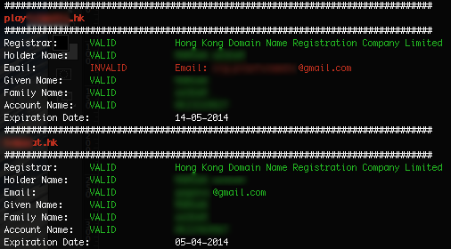

# Script helping extract the relevant information from HKDNR WHOIS results
Can be easily adapted to work with other WHOIS databases


Sample output (edited):



Variables to fill-in:
```shell
# Array of all the domains to check
declare -a DOMAINS=(
  'domainName.hk'
  'anotherDomainName.hk'
	)
# Each domain has an account number
declare -a ACCOUNTS=(
  'HKXXXXXXXT'
  'HKXXXXXXXT'
	)
	

## Templates assuming the following details are the same for all DOMAINS
##   We are using grep, so you can separate alternative answers with \|
##      i.e: HOLDERNAME="Mary\|John\|Bob" means that the holder name would be valid if the answer is Mary or John or Bob

REGISTRAR="Hong Kong Domain Name Registration Company Limited"
HOLDERNAME="the owner of the domain"
EMAIL="bogus@email.hk"
GIVENNAME="some given name"
FAMILYNAME="and a wrong family name"
```
